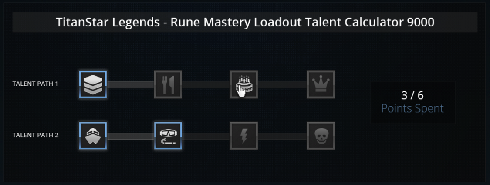

# Front-End Developer Challenge

In this repo you will find a mock-up and all the necessary assets (in a separate folder). The design is of a tool for a fictitious game called “TitanStar Legends”, and will not be repurposed or otherwise utilized by D&D Beyond – it is only a coding challenge.

Below are specific requirements we have which cannot be adequately expressed through the mock-up. This is not a timed assignment, but it should probably take a couple of hours. We ask that you have your assessment completed and returned within 7 days of receiving it. Good luck!

If you feel that you have a personal project that closely resembles this project, send us the repo and we’ll evaluate that project instead. Only your contributions will be evaluated and the project must demonstrate the following competencies with:

- Making an app mobile-friendly/responsive
- Using SCSS
- Creating a stateful JS application

## General Requirements

- You may not use any existing SCSS (SASS), LESS, or CSS frameworks.
- You must use SCSS (SASS) to demonstrate competency with the language.

## Rune Mastery Loadout Talent Calculator 9000

Players of TitanStar Legends can spend talent points that they’ve collected on runes within a tree. We need to write a js application that simulates the rune tree within the game so players can replicate their in-game loadouts to share with the TitanStar Legends community.

- Left click to add points.
- Right click to remove points.
- The user may only use up to 6 points.
- Each item only accounts for one point.
- Displays current point total
- The user must select the items in order.
  - For example: The user may not put a point in the cake without first having put points in the chevrons and the silverware (in that order).

## Available Scripts

In the project directory, you can run:

### `yarn start`

Runs the app in the development mode. 
Open [http://localhost:3000](http://localhost:3000) to view it in the browser.

The page will reload if you make edits. 
You will also see any lint errors in the console.

### `yarn test`

Launches the test runner in the interactive watch mode. 
See the section about [running tests](https://facebook.github.io/create-react-app/docs/running-tests) for more information.

### `yarn build`

Builds the app for production to the `build` folder. 
It correctly bundles React in production mode and optimizes the build for the best performance.

The build is minified and the filenames include the hashes. 
Your app is ready to be deployed!

See the section about [deployment](https://facebook.github.io/create-react-app/docs/deployment) for more information.

## Learn More

You can learn more in the [Create React App documentation](https://facebook.github.io/create-react-app/docs/getting-started).

To learn React, check out the [React documentation](https://reactjs.org/).

### Code Splitting

This section has moved here: https://facebook.github.io/create-react-app/docs/code-splitting

### Analyzing the Bundle Size

This section has moved here: https://facebook.github.io/create-react-app/docs/analyzing-the-bundle-size

### Making a Progressive Web App

This section has moved here: https://facebook.github.io/create-react-app/docs/making-a-progressive-web-app

### Advanced Configuration

This section has moved here: https://facebook.github.io/create-react-app/docs/advanced-configuration

### Deployment

This section has moved here: https://facebook.github.io/create-react-app/docs/deployment

### `yarn build` fails to minify

This section has moved here: https://facebook.github.io/create-react-app/docs/troubleshooting#npm-run-build-fails-to-minify
